# Vue CLIENTE para blog de GRUPO PROMASS

Este cliente fue desarrollado en su totalidad con VueJS 3.

<h2>Requerimientos técnicos</h2>

<ul>
  <li>NodeJS versión 18+</li>
  <li>NPM versión 10+</li>
</ul>

<h2>Herramientas de instalación</h2>

<ul>
  <li>Git (esto es necesario para la instalación via consola de comandos).</li>
</ul>

<h2>Dependencias directas</h2>

<ul>
  <li>Debe estar funcionando en local la <a href="https://github.com/DarkHawk21/promass_blog_api">API del BLOG de GRUPO PROMASS</a>, en el puerto 8000. De lo contrario, si se encuentra funcionando en otro servidor o en otro puerto, <strong>debes modificar el archivo de configuración que se encuentra en <code>./src/config/index.js</code>, sustituyendo la variable <code>_API_URL</code> por la ruta correcta en donde está la API.</strong></li>
</ul>

<h2>Proceso de instalación en local</h2>

<ol>
    <li>Abrir un navegador de internet e ingresar a la siguiente url: <a href='https://github.com/DarkHawk21/promass_blog_client' target="_blank">https://github.com/DarkHawk21/promass_blog_client</a>.  
    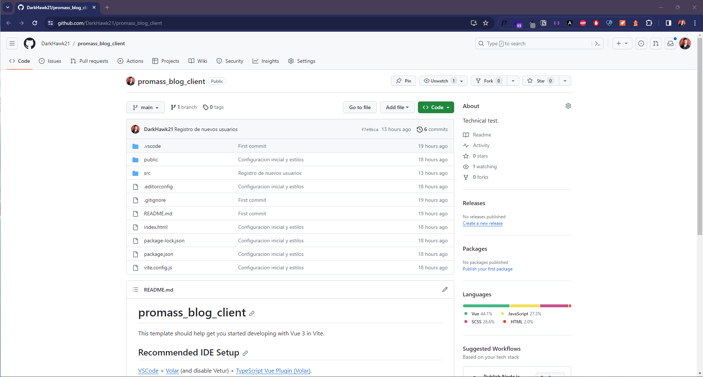</li>
    <li>Dar click en el botón verde <strong>"<>Code"</strong> y seleccionar la opción <strong>"HTTPS"</strong> para que nos aparezca la URL completa a clonar. Copiamos esa URL.  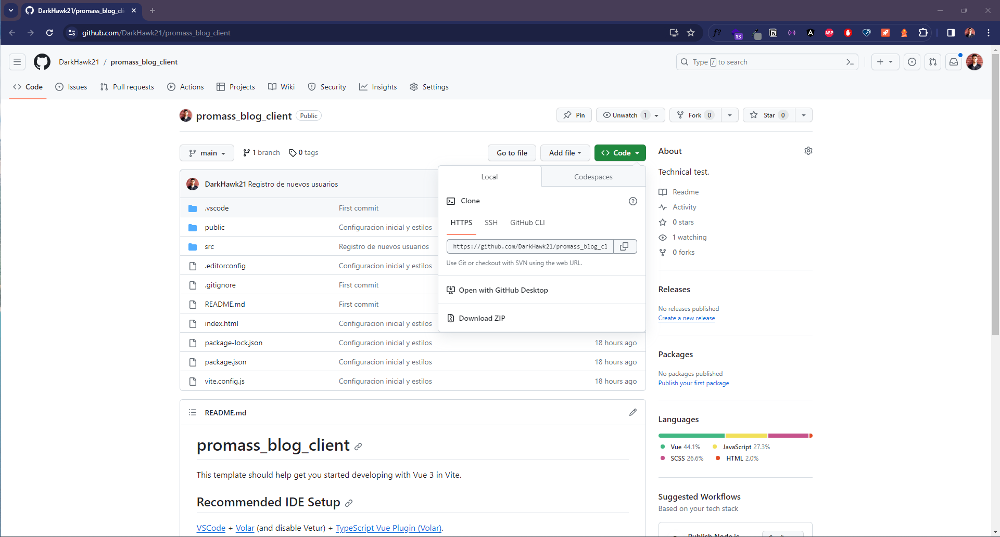</li>
    <li>En nuestra PC abrimos una terminal y nos dirigimos a la carpeta en donde queremos que se descargue nuestro proyecto, en este caso será dentro de la carpeta "WWW" de WAMP (en Windows), pero puedes descargar el proyecto en la carpeta que tú desees.  </li>
    <li>Clonamos el proyecto desde Github con la URL que obtuvimos en el paso 2. Esto lo hacemos con el comando <code>git clone https://github.com/DarkHawk21/promass_blog_client.git</code>.  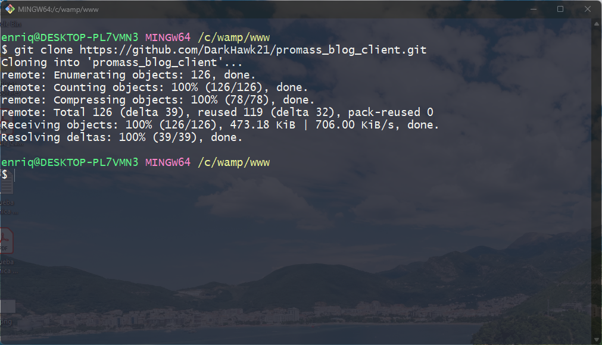</li>
    <li>Abrimos nuestra carpeta de proyecto con nuestro editor favorito.   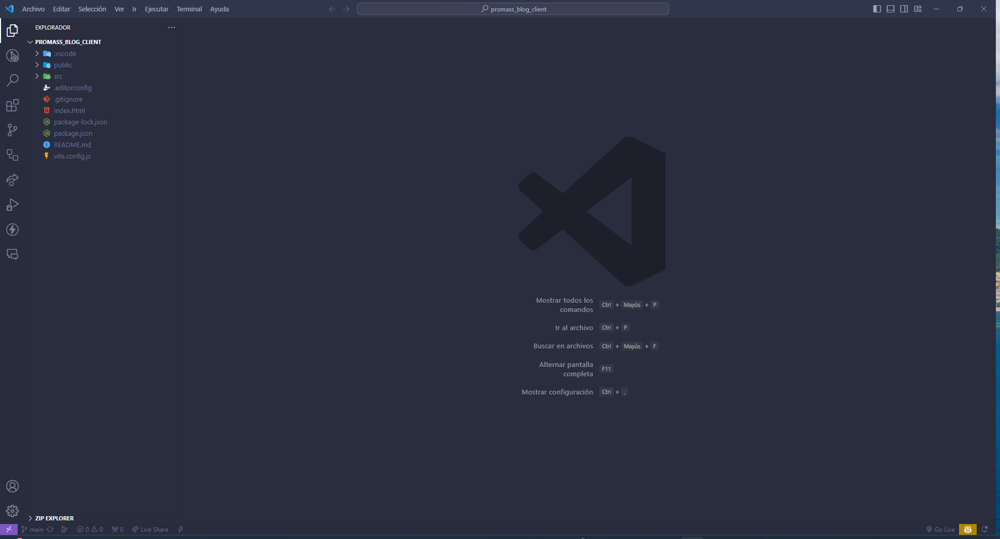</li>
    <li>Si estás en VS Code puedes abrir una terminal directamente desde ahí para que automáticamente te dirija a la ruta del proyecto. En la terminal, instalamos todas las dependencias necesarias con el comando <code>npm install</code>.  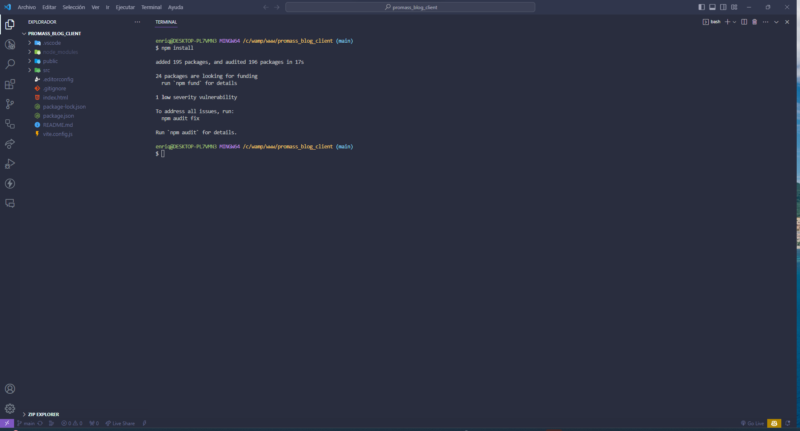</li>
    <li>En la misma terminal, escribimos el comando <code>npm run dev</code> para que VITE inicie el servidor local desde donde podremos ver y usar el CLIENTE.  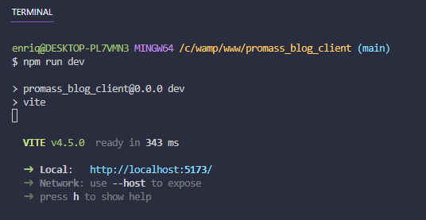</li>
    <li>Para comprobar que el CLIENTE está en línea podemos abrir nuestro navegador favorito y dirigirnos a la ruta <a href="http://127.0.0.1:5173" target="_blank">http://127.0.0.1:5173</a>.  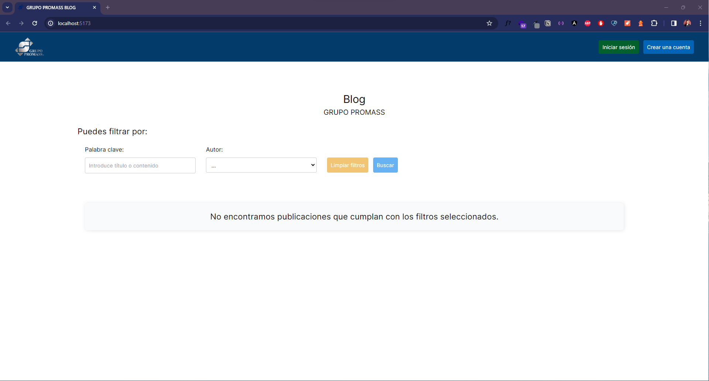</li>
</ol>

<h2>USO DEL CLIENTE</h2>

El cliente cuenta con las funcionalidades que se enlistan a continuación:

<ul>
  <li>Ver todas la entradas en el sistema.  </li>
  <li>Ver una entrada seleccionada a detalle.  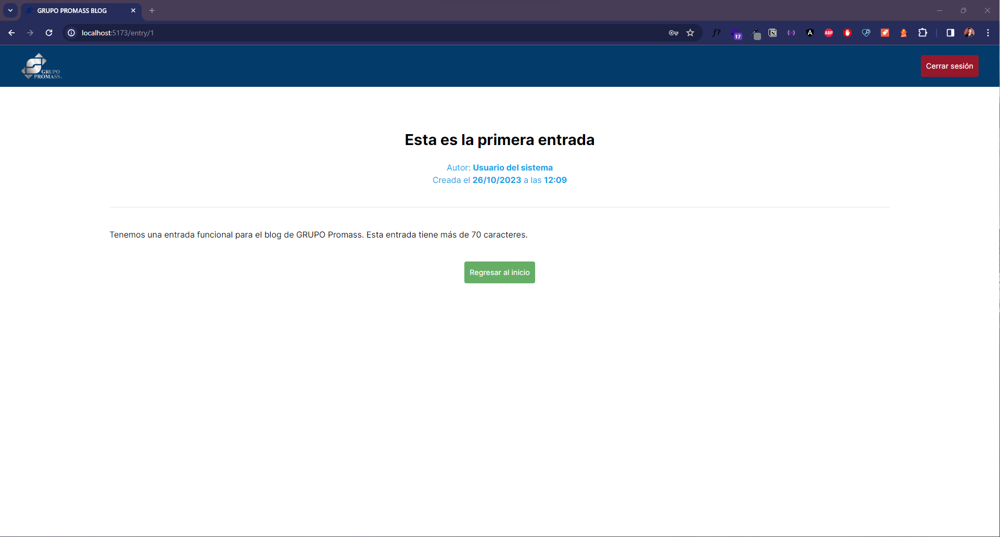</li>
  <li>Filtrar por título, contenido o autor.  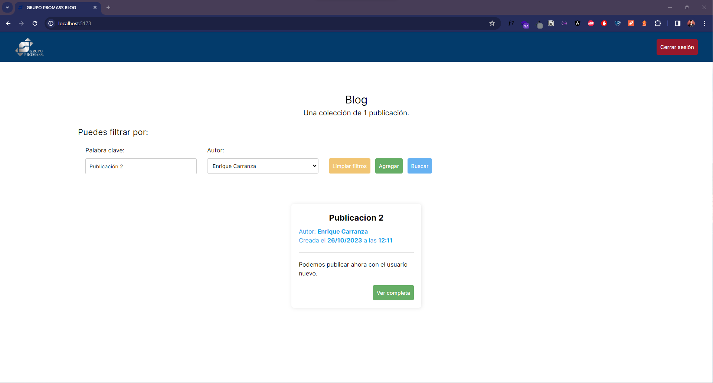</li>
  <li>Iniciar sesión para crear nuevas entradas. El sistema cuenta por defecto con un usuario de prueba cuyas credenciales son: <code>Correo: user@user.com</code> y <code>Contraseña: Pass1234</code>.  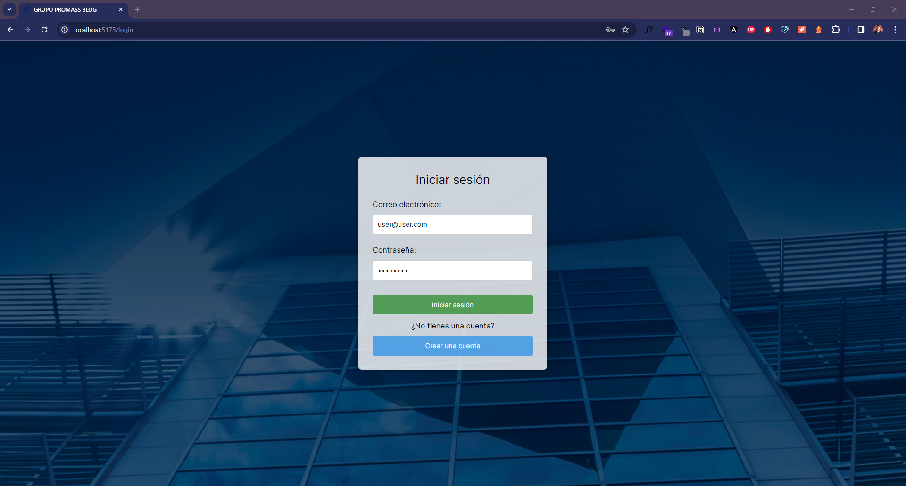</li>
  <li>Creación de nuevas entradas.  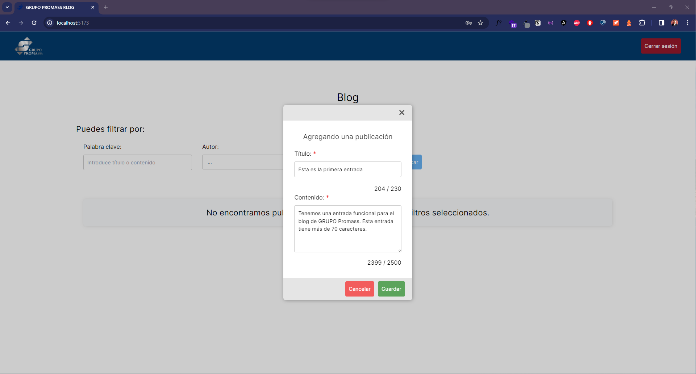  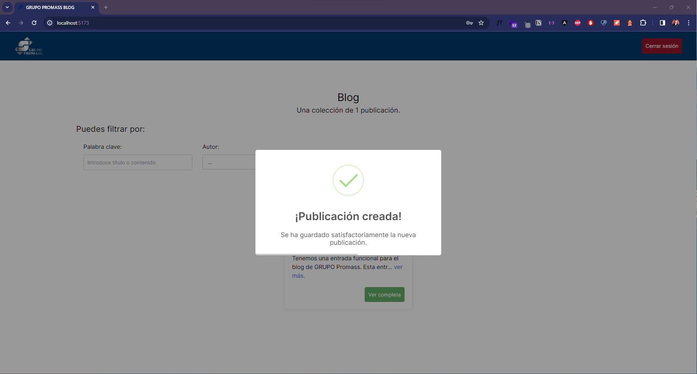  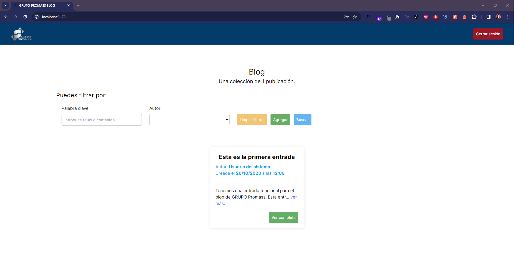</li>
  <li>Creación de nuevas cuentas de usuario.  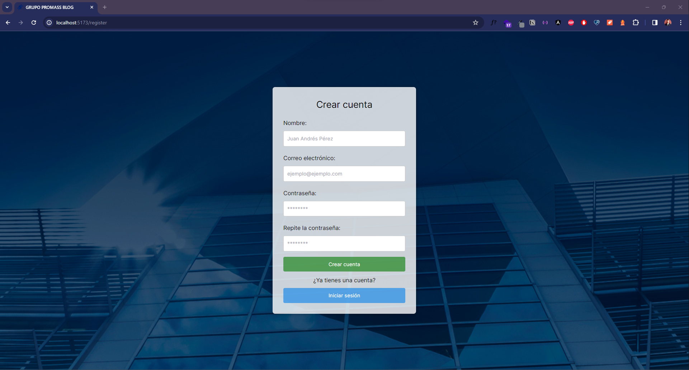  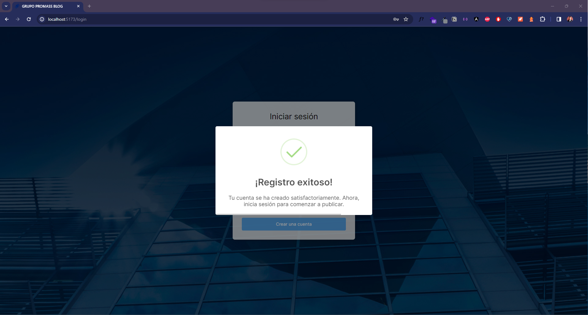</li>
</ul>
